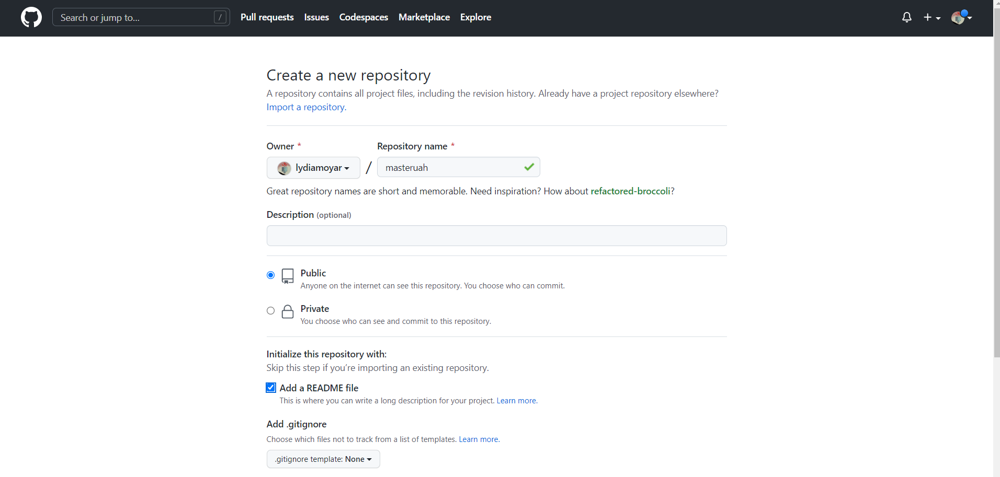
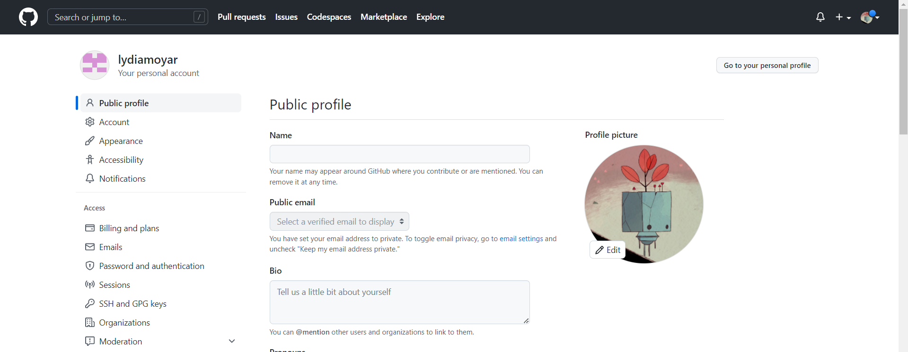
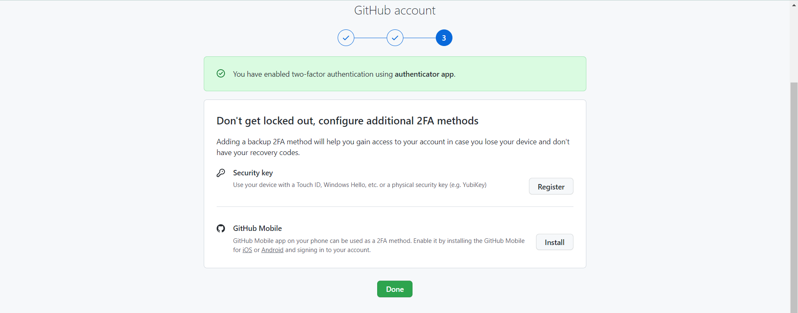
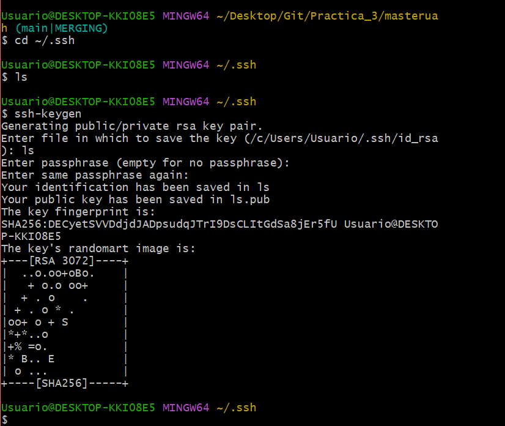
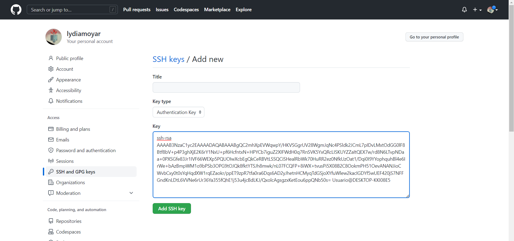
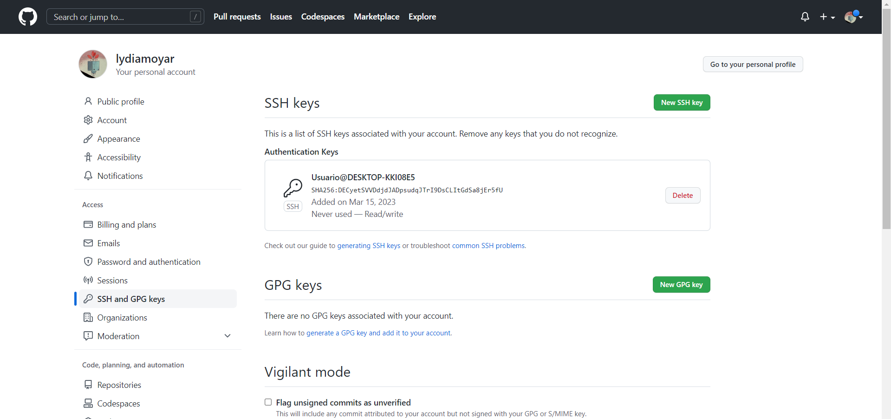

**masteruah

1. Crear un repositorio en vuestro GitHub llamado **masteruah**:
Creamos un repositorio en nuestra cuenta de GitHub como se muestra a continuación:

2. Clonar vuestro repositio en local:
Para clonar nuestro repositorio remoto en un repositorio local se inserta el comando "git clone".

3. Crear en vuestro repositorio local un documento **README.md**:
Se crea un fichero llamado "README.md"al crear nuestro repositorio.

4. Añadir al README.md los comanddos utilizados hasta ahora y hacer un commit inicial con el mensaje **commit inicial**:
- Dentro de este fichero vamos escribiendo todos los comandos que se van insertando dentro del "git bash".
- Para hacer un comentario dentro de este basta con hacer un commit, es decir, git commit -m "commit inicial".

5. Subir los cambios al repositorio remoto:
Para poder guardar los cambios hechos dentro del repositorio remoto hay que insertar el código "git push".

6. Añadir fichero **1.txt** al repositorio local:
Se añaden archivos con el comando "git add", en este caso queremos añadir el "Fichero1.txt".

7. Crear un tag **v0.1**:
Creamos un nuevo tag insertando el código "git tag".

8. Subir los cambios al repositorio remoto:
De nuevo para poder guardar los cambios hechos dentro del repositorio remoto hay que insertar el código "git push".

9. Crear una rama **v0.2**:
Queremos crear una rama llamada v0.2 por lo que habría que insertar "git branch v0.2".

10. Posiciona tu carpeta de trabajo en esta rama:
Para posicionar la carpeta en la rama v0.2 se inserta "git checkout v0.2".

11. Añadir un fichero **2.txt** en la rama **v0.2**:
Se añaden archivos con el comando "git add", en este caso queremos añadir el "2.txt".

12. Subir los cambios al reposiorio remoto:
Se guardan los cambion con el comando "git push".

13. Posicionarse en la rama **master**:
Para poder popsicionarse se inserta "git checkout main".

14. Hacer un merge de la rama **v0.2** en la rama **master**:
Se inserta "git merge v0.2" para poder fusionar la rama v0.2 en la rama main que es la principal.

15. En la rama **master** poner **Hola** en el fichero **1.txt** y hacer commit:
Abrimos el "Fichero1.txt" y escribimos "Hola", para guardarlo hacemos un "git add" y para finalizar pondremos un comentario con; git commit -m "Agregado Hola en Fichero1.txt".

16. Posicionarse en la rama **v0.2** y poner **Adios** en el fichero "1.txt" y hacer commit:
Nos vamos a la rama v0.2 con el comando "git checkout v0.2".
A continuación haremos un echo "Adios" > "Fichero1.txt" y lo añadiremos para que se guarde dentro de la rama v0.2 con el comando git add "Fichero1.txt".

17. Posicionarse de nuevo en la rama **master** y hacer un merge con la rama **v0.2**:
Nos vamos a la rama main con el comando "git checkout main".
Hacemos un merge con la rama v0.2 "git merge v0.2".

18. Listar las ramas con merge y las ramas sin merge:
Ahora listaremos las ramas con merge "git branch --merge" y las ramas que no tenga merge con "git branch --no-merge".

19. Arreglar el conflicto anterior y hacer un commit:
Compruebo si hay errores insertando "git status". Nos sale un conflicto por lo que hay que insertar un "vim Fichero1.txt" por último lo notificamos con un commit git commit -m "conflicto arreglado".

20. Crear un tag **v0.2**:
Creamos un tag para crear un punto de restauración en la rama v0.2 para ello insertamos "git tag v0.2".

21. Borrar la rama **v0.2**:
Para poder borrar la rama se utiliza el código "git branch -D v0.2".

22. Listar los distintos commits con sus ramas y sus tags:
Se enlista los distintos commits con sus ramas y sus tags correspondientes con un "git log --oneline".

23. Poner una foto en vuestro perfil de GitHub:
Ponemos una foto de perfil nueva en nuestra cuenta.

24. Poner el doble factor de autentificación en vuestra cuenta de GitHub:
A continuación ponemos la doble autentificación.

25. Añadir la clave pública que se corresponde a tu ordenador:
Generamos una clave pública la cuál se hace insertando "cd ~/.ssh", "ssh-keygen" y nos imprimirá en pantalla un código.

26. Preguntar los nombres de usuario de GitHub de tus compañeros de trabajo en grupo, búscalos, y sigueles:

27. Añadir una estrella a los repositorios del resto de tus compañeros:

28. Crear una tabla de este estilo en el fichero **README.md** con la información
de varios de tus compañeros de clase:

|        NOMBRE          |                     GITHUB                        |
|------------------------|---------------------------------------------------|
| Rafael Virgilio García | [enlace a github 1](http://github.com/i12vecaj)   |
| Pablo Gallego          | [enlace a github 1](http://github.com/i12vecaj)   |

29. Poner a [github.com/i12vecaj](http://github.com/i12vecaj) como colaborador del repositorio **masteruah**:

30. Crear una organización llamada **masteruah-tunombredeusuariodegithub**:

31. Crear 2 equipos en la organización **masteruah-tunombredeusuariodegithub**, uno llamado **administradores** con más permisos y otro **colaboradores** con menos permisos:

32. Meter a [github.com/i12vecaj](http://github.com/i12vecaj) y a 2 de vuestros compañeros de clase en el equipo **administradores**:

33. Meter a [github.com/i12vecaj](http://github.com/i12vecaj) y a otros 2 de vuestros compañeros de clase en el equipo **colaboradores**:

34. Crear un index.html que se pueda ver como página web en la organización:

35. Hacer 2 forks de 2 repositorios **masteruah-tunombredeusuariodegithub.github.io** de 2 organizaciones de las que no seais ni administradiores ni colaboradores:

36. Crearos una rama en cada fork:

37. En cada rama modificar el fichero **index.html** añadiendo vuestro nombre:

38. Con cada rama hacer un pull-request:

39. Aceptar los pull-request que lleguen a los repositorios de tu organización:

